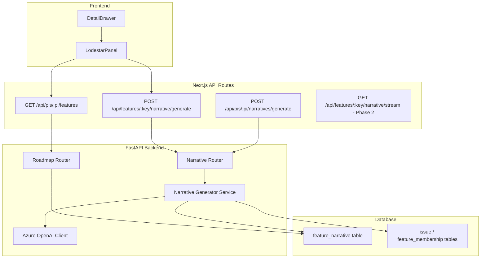

# Design Document: Lodestar AI Narratives

## Overview

This feature adds AI-generated delivery narratives to the WaypointPI Program Roadmap. Each feature (epic) receives a persisted 2–3 sentence AI-generated paragraph summarizing its delivery health, risks, and trajectory. Narratives are generated via Azure OpenAI (GPT-4o-mini), stored in the database with metadata (timestamp, model name), served through the existing `FeatureItemOut` API response, and regenerated when underlying data changes or on user demand.

The design reuses the proven Azure OpenAI patterns from the existing enrichment module (`_get_openai_client`, `_call_with_retry`, error taxonomy) while adding a new persistence layer and background processing model specific to per-feature narratives.

### Key Design Decisions

1. **One-to-one narrative storage** — A dedicated `feature_narrative` table with a unique constraint on `feature_issue_id` ensures at most one narrative per feature. Upsert semantics simplify replacement.
2. **Read-only API path** — The Feature API only reads persisted narratives. Generation is always a separate async/background concern, keeping API latency under 300ms.
3. **Sequential batch processing** — Batch generation processes features one at a time to stay within Azure OpenAI rate limits without complex throttling logic.
4. **Staleness marking on sync** — Rather than regenerating immediately during data sync, narratives are marked stale and regenerated in the background, decoupling sync latency from AI processing.
5. **Graceful degradation** — On any generation failure, the previously stored narrative is preserved. The UI never shows a broken state.

## Architecture



### Data Flow

1. **Read path**: `GET /api/pis/{pi}/features` → roadmap router joins `feature_narrative` table → returns `lodestar_static` + `generated_at` in `FeatureItemOut`.
2. **On-demand generation**: `POST /api/features/{key}/narrative/generate` → narrative router gathers context from issue/sprint tables → calls Azure OpenAI → upserts `feature_narrative` → returns result.
3. **Batch generation**: `POST /api/pis/{pi}/narratives/generate` → iterates features sequentially → same generation flow per feature → returns summary.
4. **Staleness trigger**: Data sync completion → detect changed features → mark narratives stale → enqueue background regeneration tasks.

## Components and Interfaces

### 1. `feature_narrative` Table (New)

SQLAlchemy model added to `app/models.py`.

```python
class FeatureNarrative(Base):
    __tablename__ = "feature_narrative"

    id: Mapped[int] = mapped_column(primary_key=True)
    feature_issue_id: Mapped[int] = mapped_column(
        ForeignKey("issue.id"), unique=True, nullable=False
    )
    narrative_text: Mapped[str] = mapped_column(Text, nullable=False)
    generated_at: Mapped[datetime] = mapped_column(DateTime, nullable=False)
    model_name: Mapped[str] = mapped_column(String(100), nullable=False)
    is_stale: Mapped[bool] = mapped_column(Boolean, default=False)

    feature: Mapped["Issue"] = relationship()
```

### 2. Narrative Generator Service (`app/narrative.py` — New)

Encapsulates context gathering, prompt construction, and LLM interaction.

```python
class NarrativeContext:
    """Structured context for narrative prompt."""
    feature_key: str
    feature_summary: str
    completion_pct: float        # done / total child stories
    blocker_count: int           # unresolved blocking links
    sprint_velocity: float       # avg stories done per sprint (last 3)
    recent_status_changes: int   # status changes in last 14 days
    team_name: str
    days_remaining: int          # days left in PI

class NarrativeResult:
    """Output of successful generation."""
    narrative_text: str
    generated_at: datetime
    model_name: str

def gather_context(session: Session, feature_issue_id: int, pi_id: int) -> NarrativeContext:
    """Gather all context needed for narrative generation."""
    ...

def generate_narrative(session: Session, feature_issue_id: int, pi_id: int) -> NarrativeResult:
    """Full generation pipeline: gather context → build prompt → call LLM → persist."""
    ...

def generate_batch(session: Session, pi_id: int) -> BatchResult:
    """Generate narratives for all features in a PI sequentially."""
    ...

def mark_stale(session: Session, feature_issue_ids: list[int]) -> int:
    """Mark narratives as stale for the given features."""
    ...
```

### 3. Narrative Router (`app/api/routers/narrative.py` — New)

FastAPI router exposing narrative generation endpoints.

| Endpoint | Method | Description |
|----------|--------|-------------|
| `/api/features/{feature_key}/narrative/generate` | POST | On-demand single feature generation |
| `/api/pis/{pi}/narratives/generate` | POST | Batch generation for all features in a PI |
| `/api/features/{feature_key}/narrative/stream` | GET | SSE streaming (Phase 2) |

### 4. Modified `FeatureItemOut` Schema

Add `generated_at` field:

```python
class FeatureItemOut(BaseModel):
    # ... existing fields ...
    lodestar_static: Optional[str]
    generated_at: Optional[str]  # ISO 8601 UTC timestamp
```

### 5. Modified Roadmap Router

Join `feature_narrative` table during query to populate `lodestar_static` and `generated_at` in the response. No generation logic in this path.

### 6. Modified LodestarPanel Component

Extend to include:
- "Regenerate" button
- Loading state during regeneration
- Error display on failure
- `generated_at` formatted as relative time (e.g., "Generated 2 hours ago")

## Data Models

### feature_narrative Table Schema

| Column | Type | Constraints | Description |
|--------|------|-------------|-------------|
| id | INTEGER | PK, auto-increment | Primary key |
| feature_issue_id | INTEGER | FK(issue.id), UNIQUE, NOT NULL | One-to-one link to feature epic |
| narrative_text | TEXT | NOT NULL | The AI-generated narrative (2–3 sentences) |
| generated_at | DATETIME | NOT NULL | UTC timestamp of generation |
| model_name | VARCHAR(100) | NOT NULL | Azure OpenAI deployment name used |
| is_stale | BOOLEAN | DEFAULT FALSE | Whether underlying data has changed since generation |

### NarrativeContext (Internal DTO)

| Field | Type | Source | Default |
|-------|------|--------|---------|
| feature_key | str | Issue.jira_key | — |
| feature_summary | str | Issue.summary | — |
| completion_pct | float | count(done children) / count(all children) | 0.0 |
| blocker_count | int | count(unresolved "blocks" links targeting children) | 0 |
| sprint_velocity | float | avg(done per sprint) over last 3 closed sprints | 0.0 |
| recent_status_changes | int | count(status_category changes in last 14 days) | 0 |
| team_name | str | Project key → team mapping | "unknown" |
| days_remaining | int | (PI end_date - now).days | 0 |

### API Response Schemas

**On-demand generation response:**
```json
{
  "narrative_text": "Feature Alpha is 65% complete with 2 active blockers...",
  "generated_at": "2025-01-15T10:30:00Z"
}
```

**Batch generation response:**
```json
{
  "total": 12,
  "generated": 11,
  "failed": 1,
  "failures": [
    {"feature_key": "ALPHA-5", "error": "ProviderTimeoutError: ..."}
  ]
}
```

## Correctness Properties

*A property is a characteristic or behavior that should hold true across all valid executions of a system — essentially, a formal statement about what the system should do. Properties serve as the bridge between human-readable specifications and machine-verifiable correctness guarantees.*

### Property 1: Narrative persistence one-to-one invariant

*For any* feature and any sequence of narrative generation calls targeting that feature, the `feature_narrative` table SHALL contain at most one row for that feature, with the most recently generated text, a valid UTC `generated_at` timestamp, and a model name of at most 100 characters.

**Validates: Requirements 1.1, 1.2, 1.3, 1.4**

### Property 2: Non-existent feature rejection

*For any* feature issue ID or feature key that does not exist in the database, calling the narrative generation endpoint SHALL return an error response (HTTP 404) and SHALL NOT insert any row into the `feature_narrative` table.

**Validates: Requirements 1.5, 4.6**

### Property 3: Context computation correctness

*For any* feature with child stories in the database, the gathered `completion_pct` SHALL equal the count of child stories with `status_category = "done"` divided by total child story count, `blocker_count` SHALL equal the count of unresolved "blocks" links targeting child stories, and `sprint_velocity` SHALL equal the average done count over the last 3 closed sprints (or 0 if fewer exist).

**Validates: Requirements 2.1, 2.2**

### Property 4: API narrative read-through

*For any* feature, the `lodestar_static` field in the `FeatureItemOut` API response SHALL equal the verbatim `narrative_text` from the `feature_narrative` table if a row exists, or `null` otherwise; and `generated_at` SHALL equal the stored ISO 8601 UTC timestamp or `null` respectively.

**Validates: Requirements 3.1, 3.2, 3.4, 3.5**

### Property 5: Staleness detection correctness

*For any* data sync that creates or modifies issue data (completion percentage, blocker count, status category, or assignee) belonging to features with existing narratives, those narratives SHALL be marked as `is_stale = True`, and narratives for unaffected features SHALL remain unchanged.

**Validates: Requirements 4.1**

### Property 6: Failure preserves existing narrative

*For any* feature with a previously stored narrative, if narrative generation fails (LLM error, timeout, rate limit), the existing `narrative_text` and `generated_at` in the database SHALL remain unchanged.

**Validates: Requirements 4.3, 6.2**

### Property 7: Batch generation accounting

*For any* PI with N features, after batch generation completes, the response `generated + failed` SHALL equal N, and for each feature where generation succeeded, a valid narrative SHALL exist in the database.

**Validates: Requirements 5.3, 5.4**

### Property 8: Invalid LLM response rejection

*For any* LLM response that cannot be parsed as valid narrative text (empty, malformed, exceeds constraints), the system SHALL NOT persist the response and SHALL return a structured error.

**Validates: Requirements 6.5**

### Property 9: Relative time formatting

*For any* UTC timestamp, the `formatRelativeTime` function SHALL produce a human-readable relative time string (e.g., "Generated 2 hours ago", "Generated just now") that correctly reflects the elapsed duration from that timestamp to the current time.

**Validates: Requirements 9.6**

## Error Handling

### Error Taxonomy (Reused from Enrichment Module)

| Error Type | HTTP Status | Trigger | Behavior |
|-----------|-------------|---------|----------|
| `ProviderNotConfiguredError` | 503 | Missing `AZURE_OPENAI_ENDPOINT` env var | Return descriptive message |
| `ProviderAuthError` | 401 | Azure credential failure | No retry, return immediately |
| `ProviderRateLimitError` | 429 | Azure throttling (429 response) | Retry with backoff, then fail |
| `ProviderTimeoutError` | 504 | Request timeout (>30s) | Retry with backoff, then fail |
| `LLMParseError` | 502 | Unparseable LLM response | Discard, do not persist |

### Retry Strategy

Same as enrichment module: 3 attempts with exponential backoff (2s, 4s, 8s). Auth errors are not retried.

### Graceful Degradation Rules

1. **On generation failure**: Preserve existing narrative. Return error to caller. Log failure.
2. **On batch failure for one feature**: Continue processing remaining features. Report failure in summary.
3. **On background regeneration failure**: Keep stale narrative (still visible to users). Log failure. Do not retry automatically.
4. **On missing configuration**: Return 503 with actionable message. Feature API continues serving `null` narratives.

### Frontend Error Handling

- **Regeneration failure**: Show inline toast/message. Re-enable the Regenerate button. Do not clear existing narrative text.
- **API returns null narrative**: Show "AI narrative not yet generated" placeholder (existing behavior).

## Testing Strategy

### Property-Based Tests (Hypothesis — Python)

The feature's core logic (context gathering, persistence invariants, batch accounting) is well-suited to property-based testing because:
- Context computation is a pure function of database state (varies with story counts, statuses, links)
- Persistence invariants must hold across all possible generation sequences
- Batch accounting must be correct for any combination of successes and failures

**Library**: [Hypothesis](https://hypothesis.readthedocs.io/) (Python)
**Configuration**: Minimum 100 iterations per property test (`@settings(max_examples=100)`)
**Tag format**: `# Feature: lodestar-ai-narratives, Property {N}: {title}`

Properties to implement:
1. Narrative persistence one-to-one invariant
2. Non-existent feature rejection
3. Context computation correctness
4. API narrative read-through
5. Staleness detection correctness
6. Failure preserves existing narrative
7. Batch generation accounting
8. Invalid LLM response rejection
9. Relative time formatting

### Unit Tests (pytest)

- Prompt construction includes all context fields
- `max_tokens=200` and `temperature=0.3` passed to OpenAI
- 503 returned when env vars missing
- Error taxonomy classification (reusing enrichment patterns)
- LodestarPanel renders narrative text
- LodestarPanel shows placeholder when null
- Regenerate button triggers API call
- Loading state during regeneration

### Integration Tests

- End-to-end generation: seed DB → call endpoint → verify persistence
- Batch endpoint processes all features in a PI
- Data sync triggers staleness marking
- Feature API performance under 300ms with 30 features
- SSE streaming (Phase 2) delivers tokens and persists

### Frontend Component Tests (Vitest + React Testing Library)

- LodestarPanel displays Regenerate button
- Button disabled during loading
- Error message shown on failure
- Relative time formatting for various timestamps
- Progressive token rendering (Phase 2)
