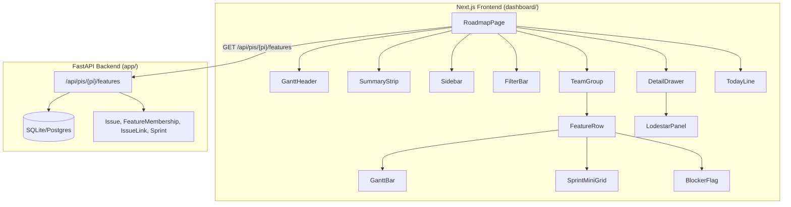

# Design Document: Roadmap Redesign

## Overview

This design describes a complete rewrite of the WaypointPI Program Roadmap page, replacing the current monolithic `roadmap/page.tsx` with a modular, Gantt-style interactive view. The redesign introduces a dedicated `FeatureItem` API endpoint, a dual-PI column layout, team-based feature grouping, a detail drawer with AI-enriched narratives, and per-sprint health indicators.

The current implementation is a single-file ~300-line component fetching from a generic `/api/roadmap` endpoint. The redesign decomposes this into 10+ focused components under `components/roadmap/`, backed by a new `GET /api/pis/{pi}/features` endpoint that returns structured progress, RAG status, blockers, and pre-generated Lodestar AI text.

**Key Design Decisions:**
- **Client-side rendering** — the roadmap is a highly interactive view with filters, drawers, and hover states. A `"use client"` page with `fetch` on mount preserves interactivity while keeping the component tree modular.
- **CSS-only visibility toggling for filters** — team filtering uses CSS `display:none` rather than conditional React rendering, achieving sub-16ms filter updates without re-render overhead.
- **Fixed dual-column layout** — PI 26.2 and PI 26.3 render as fixed-width columns (not a continuous timeline) to enable direct side-by-side comparison.
- **`inert` attribute for focus trapping** — the Detail Drawer uses the native `inert` attribute on background content, avoiding complex focus-trap libraries.

## Architecture



### Data Flow

1. `RoadmapPage` mounts and fetches `GET /api/pis/26.2/features` and `GET /api/pis/26.3/features` in parallel.
2. API queries `Issue` (epics), joins `FeatureMembership` for story counts, `IssueLink` for blockers, and `Sprint` for per-sprint breakdowns.
3. Response includes `pi_completion`, `rag_status`, `blockers`, `is_blocked_by`, `sprint_breakdown`, and `lodestar_static`.
4. Frontend renders both PI columns with feature rows grouped by team. Filtering operates on CSS classes. Clicking a row opens the Detail Drawer.

## Components and Interfaces

### Component Tree

| Component | Path | Responsibility |
|-----------|------|---------------|
| `RoadmapPage` | `app/roadmap/page.tsx` | Page shell, data fetching, state management |
| `GanttHeader` | `components/roadmap/GanttHeader.tsx` | PI column headers, sprint bands, month labels |
| `SummaryStrip` | `components/roadmap/SummaryStrip.tsx` | 5 KPI stat cells |
| `Sidebar` | `components/roadmap/Sidebar.tsx` | 200px feature label column |
| `FilterBar` | `components/roadmap/FilterBar.tsx` | Team filter pills |
| `TeamGroup` | `components/roadmap/TeamGroup.tsx` | Collapsible team grouping |
| `FeatureRow` | `components/roadmap/FeatureRow.tsx` | Single feature row with click handler |
| `GanttBar` | `components/roadmap/GanttBar.tsx` | Three-segment progress bar |
| `SprintMiniGrid` | `components/roadmap/SprintMiniGrid.tsx` | 5 mini-bars for PI 26.3 sprints |
| `DetailDrawer` | `components/roadmap/DetailDrawer.tsx` | 300px slide-in panel |
| `LodestarPanel` | `components/roadmap/LodestarPanel.tsx` | AI narrative display |
| `TodayLine` | `components/roadmap/TodayLine.tsx` | Vertical date indicator |
| `BlockerFlag` | `components/roadmap/BlockerFlag.tsx` | ⚠ cross-team dependency icon |

### Component Props Interfaces

```typescript
// types/roadmap.ts

export interface FeatureItem {
  feature_key: string;
  summary: string;
  team: "Alpha" | "Bravo" | "Charlie";
  assignee: string | null;
  status: string;
  status_category: string;
  rag_status: "red" | "amber" | "green";
  pi_completion: PICompletion[];
  blockers: string[];        // issue keys this feature blocks
  is_blocked_by: string[];   // issue keys blocking this feature
  sprint_breakdown: SprintBreakdown[];
  lodestar_static: string | null;
}

export interface PICompletion {
  pi_name: string;
  done_pct: number;
  prog_pct: number;
  todo_pct: number;
  story_count: number;
  sp_done: number;
  sp_total: number;
}

export interface SprintBreakdown {
  sprint_name: string;
  state: "active" | "future" | "closed";
  story_count: number;
  done_count: number;
}

export interface KPISummary {
  total_features: number;
  on_track: number;
  at_risk: number;
  total_stories: number;
  blocked: number;
}
```

### GanttBar Props

```typescript
interface GanttBarProps {
  donePct: number;
  progPct: number;
  todoPct: number;
  columnWidth: number;  // available pixel width for the bar
}
```

### DetailDrawer Props

```typescript
interface DetailDrawerProps {
  feature: FeatureItem | null;
  open: boolean;
  onClose: () => void;
}
```

### FilterBar Props

```typescript
interface FilterBarProps {
  activeTeam: "All" | "Alpha" | "Bravo" | "Charlie";
  onFilterChange: (team: string) => void;
}
```

## Data Models

### Backend: FeatureItem Response Schema (Pydantic)

```python
# app/api/schemas.py additions

class PICompletionOut(BaseModel):
    pi_name: str
    done_pct: float
    prog_pct: float
    todo_pct: float
    story_count: int
    sp_done: float
    sp_total: float

class SprintBreakdownOut(BaseModel):
    sprint_name: str
    state: str  # "active" | "future" | "closed"
    story_count: int
    done_count: int

class FeatureItemOut(BaseModel):
    feature_key: str
    summary: str
    team: str
    assignee: Optional[str]
    status: str
    status_category: str
    rag_status: str  # "red" | "amber" | "green"
    pi_completion: list[PICompletionOut]
    blockers: list[str]
    is_blocked_by: list[str]
    sprint_breakdown: list[SprintBreakdownOut]
    lodestar_static: Optional[str]
```

### Backend: API Route

```python
# app/api/routers/roadmap.py — new endpoint

@router.get("/api/pis/{pi}/features", response_model=list[FeatureItemOut])
def get_pi_features(pi: str):
    """Return structured feature progress data for a given PI."""
    ...
```

### RAG Status Derivation Logic

```python
def compute_rag_status(done_pct: float, days_remaining: int, is_blocked: bool) -> str:
    if is_blocked:
        return "red"
    if done_pct >= 80 or days_remaining > 21:
        return "green"
    if done_pct >= 50 or days_remaining > 7:
        return "amber"
    return "red"
```

### Database Schema (existing, no migrations needed)

The existing `Issue`, `FeatureMembership`, `IssueLink`, `Sprint`, and `ProgramIncrement` tables provide all necessary data. The new endpoint joins these tables differently:

- **Team derivation**: From `Issue.project_id → Project.jira_key` prefix mapping (e.g., "TSU" → Alpha, "ISC" → Bravo, "PNR" → Charlie)
- **Blockers**: From `IssueLink` where `link_type = 'blocks'`
- **Sprint breakdown**: From `Sprint` joined to `Issue` via `sprint_id`, filtered by PI

## Correctness Properties

*A property is a characteristic or behavior that should hold true across all valid executions of a system — essentially, a formal statement about what the system should do. Properties serve as the bridge between human-readable specifications and machine-verifiable correctness guarantees.*

### Property 1: Completion percentages sum to 100

*For any* FeatureItem returned by the API, the values `done_pct + prog_pct + todo_pct` in each `pi_completion` entry SHALL sum to exactly 100 (within floating-point tolerance).

**Validates: Requirements 2.2**

### Property 2: RAG status is always a valid enum value

*For any* feature data (any combination of done_pct, days_remaining, and is_blocked state), the computed `rag_status` SHALL always be one of "red", "amber", or "green".

**Validates: Requirements 2.3**

### Property 3: Gantt bar segment widths are proportional to percentages

*For any* valid (done_pct, prog_pct, todo_pct) tuple summing to 100 and any positive column_width, the pixel widths of the three Gantt bar segments SHALL be proportional to their respective percentages, and the total of all segment widths SHALL equal column_width (within rounding tolerance of ±1px).

**Validates: Requirements 4.5**

### Property 4: Minimum segment width enforcement

*For any* Gantt bar where a segment has a non-zero percentage, that segment's rendered pixel width SHALL be at least 4px.

**Validates: Requirements 4.2**

### Property 5: Label placement threshold

*For any* Gantt bar, WHEN `done_pct >= 15` the percentage label SHALL be positioned inside the Done segment, and WHEN `done_pct < 15` the label SHALL be positioned outside the bar to the right.

**Validates: Requirements 4.3, 4.4**

### Property 6: Today line position formula

*For any* date that falls within a PI's date range (pi_start ≤ date ≤ pi_end), the Today line SHALL be positioned at `(date - pi_start) / (pi_end - pi_start) * column_width` pixels from the left edge of that PI's column, and SHALL NOT appear in the other PI column.

**Validates: Requirements 5.2, 5.3**

### Property 7: Team filter visibility

*For any* team filter selection (Alpha, Bravo, or Charlie) and any set of features, only Feature_Rows belonging to the selected team SHALL be visible, and all other Feature_Rows SHALL be hidden.

**Validates: Requirements 6.3**

### Property 8: KPI computation invariant

*For any* set of FeatureItems, the Summary_Strip SHALL display: "on track" count equal to features where `rag_status == "green"`, "at risk" count equal to features where `rag_status == "amber" OR rag_status == "red"`, and "blocked" count equal to features where `is_blocked_by.length > 0`.

**Validates: Requirements 9.2, 9.3, 9.4**

### Property 9: Filtered KPI recalculation

*For any* team filter applied to any set of features, the Summary_Strip KPI values SHALL equal the KPI computation applied only to features matching the selected team.

**Validates: Requirements 6.5**

### Property 10: Detail drawer displays all feature data

*For any* FeatureItem, when the Detail Drawer is opened for that feature, it SHALL display the feature_key, summary, rag_status, assignee, a progress bar with correct done/prog/todo percentages, and all entries from blockers and is_blocked_by arrays.

**Validates: Requirements 7.3, 7.4, 7.5**

### Property 11: Blocker flag cross-team rule

*For any* feature and any dependency configuration, the Blocker_Flag icon SHALL be displayed if and only if the feature has at least one blocking dependency where the source team differs from the target team.

**Validates: Requirements 10.1, 10.2**

### Property 12: Sprint mini-grid always renders 5 bars

*For any* feature in PI 26.3, the Sprint_Mini_Grid SHALL render exactly 5 mini-bars, one per sprint, regardless of whether the feature has stories in those sprints.

**Validates: Requirements 8.1**

### Property 13: Aria-labels on Gantt bar segments

*For any* Gantt bar with non-zero segments, each visible segment SHALL have an `aria-label` attribute containing both the percentage value and the category name (done, in-progress, or todo).

**Validates: Requirements 11.2**

## Error Handling

### API Error Handling

| Scenario | Response | Details |
|----------|----------|---------|
| Invalid PI parameter | HTTP 404 | `{"detail": "Program Increment '{pi}' not found"}` |
| Database connection failure | HTTP 503 | `{"detail": "Service temporarily unavailable"}` |
| Malformed request | HTTP 422 | FastAPI default validation error |

### Frontend Error Handling

| Scenario | Behavior |
|----------|----------|
| API fetch failure | Display error banner with retry button; show cached data if available |
| Empty feature set | Show empty state message: "No features found for this PI" |
| Missing PI completion data | Render GanttBar with 0% done, 0% in-progress, 100% todo |
| Missing lodestar_static | Render "AI narrative not yet generated" placeholder in LodestarPanel |
| Feature with no team | Assign to "Unassigned" group, excluded from team filter counts |

### Error Boundary

Wrap the `RoadmapPage` component tree in a React Error Boundary (`components/ErrorBoundary.tsx` already exists) to catch render errors and display a fallback UI.

## Testing Strategy

### Property-Based Tests (fast-check)

Property-based testing applies well to this feature because there are several pure computational functions with well-defined input/output behavior:

- **Gantt bar segment width calculation** (Properties 3, 4, 5)
- **Today line position computation** (Property 6)
- **RAG status derivation** (Property 2)
- **KPI aggregation and filtering** (Properties 8, 9)
- **Blocker flag cross-team logic** (Property 11)
- **Completion percentage invariant** (Property 1)

**Library**: `fast-check` (TypeScript PBT library, compatible with the existing Next.js/TypeScript stack)
**Configuration**: Minimum 100 iterations per property test
**Tag format**: `Feature: roadmap-redesign, Property {N}: {description}`

Each correctness property above maps to a single property-based test.

### Unit Tests (example-based)

- **GanttBar rendering**: Verify correct colors, segment order, visual output for specific percentage combinations (0/0/100, 50/30/20, 100/0/0)
- **FilterBar**: Verify pill rendering, active state styling
- **DetailDrawer**: Verify open/close mechanics (Escape, click-outside, close button), focus trapping with `inert`
- **SprintMiniGrid**: Verify active sprint color, future sprint color, hatch pattern for empty sprints
- **SummaryStrip**: Verify 5 stat cells render with correct labels
- **TodayLine**: Verify coral color, 2px width, absence when date is outside PIs
- **Accessibility**: Keyboard navigation, `prefers-reduced-motion` media query

### Integration Tests

- **FeatureItem API**: Full request/response cycle with seeded database — verify schema, 404 handling, response time
- **RoadmapPage end-to-end**: Render page with mock API, verify components compose correctly, filter interactions work

### Performance Tests

- **API response time**: Assert < 300ms for full feature set
- **Filter toggle timing**: Assert CSS-only toggle completes in one frame (< 16ms)
- **TTI measurement**: Lighthouse CI in CI pipeline

