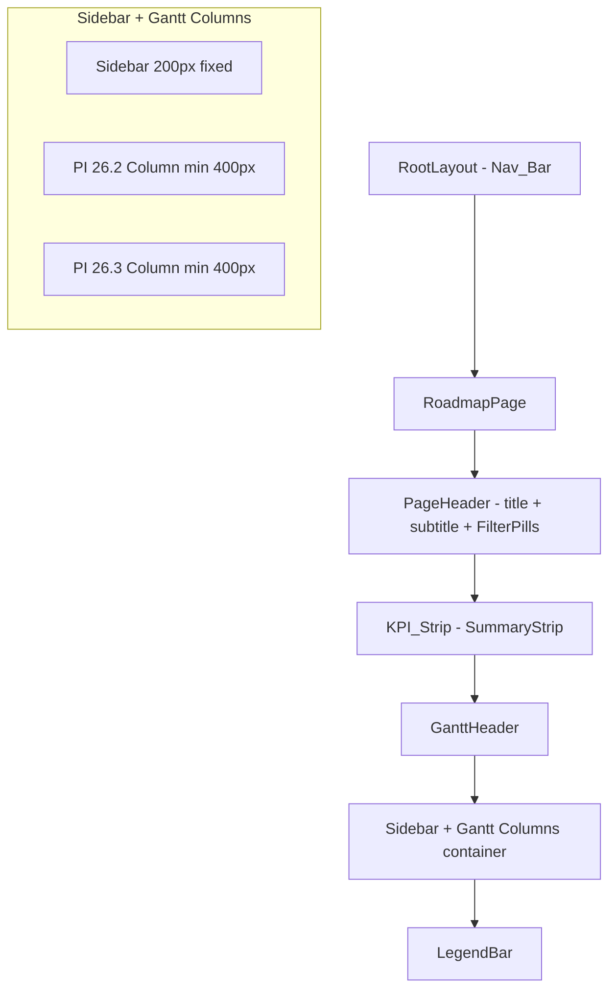

# Design Document: Roadmap Visual Alignment

## Overview

This design covers the visual and layout refinements needed to align the existing WaypointPI roadmap page with the HTML reference design. The roadmap page already has functioning components (GanttBar, GanttHeader, FilterBar, SummaryStrip, Sidebar, TeamGroup, FeatureRow, SprintMiniGrid, BlockerFlag, DetailDrawer, TodayLine) with correct data logic. This effort focuses exclusively on visual presentation: layout structure, spacing, colors, typography, component arrangement, and adding missing UI elements (Page_Header, Legend_Bar, Team_Letter_Icon, RAG badges).

### Key Design Decisions

1. **Inline styles over CSS modules** — The existing codebase uses inline React styles (no CSS modules or styled-components). We continue this pattern for consistency, extracting shared design tokens into a `tokens.ts` constants file.
2. **Component modification over replacement** — Existing components are enhanced in-place rather than rewritten. New elements (PageHeader, LegendBar, TeamLetterIcon, RagBadge) are added as new components.
3. **Nav_Bar changes in root layout** — The layout.tsx header is updated directly since it's the single source for the navbar.
4. **No breaking API changes** — Component props are extended (not changed) where new data is needed.

## Architecture

The roadmap page follows a vertical stacking layout with a fixed sidebar:



### Layout Flow

```
┌─────────────────────────────────────────────────────┐
│  Nav_Bar (#1e293b) — WaypointPI + Lodestar active   │
├─────────────────────────────────────────────────────┤
│  PageHeader: "Program Roadmap" + subtitle + pills   │
├─────────────────────────────────────────────────────┤
│  KPI_Strip: 5 cards on #f8fafc background           │
├─────────────────────────────────────────────────────┤
│  GanttHeader: PI names + date ranges + sprint bands │
├────────┬────────────────────────────────────────────┤
│Sidebar │  PI 26.2 Column   │   PI 26.3 Column      │
│ 200px  │  (Gantt bars)     │   (Mini grids)        │
│        │                   │                        │
├────────┴────────────────────────────────────────────┤
│  LegendBar: color key + interaction hints           │
└─────────────────────────────────────────────────────┘
```

## Components and Interfaces

### New Components

#### 1. `PageHeader` (`components/roadmap/PageHeader.tsx`)

Renders the page title, subtitle metadata line, and houses the FilterPills.

```typescript
interface PageHeaderProps {
  title: string;                    // "Program Roadmap"
  orgName: string;                  // Organization name
  piRange: string;                  // e.g. "PI 26.2 → 26.3"
  teamCount: number;
  featureCount: number;
  asOfDate: string;                 // Formatted date string
  children?: React.ReactNode;       // FilterPills slot
}
```

#### 2. `LegendBar` (`components/roadmap/LegendBar.tsx`)

Footer bar explaining color coding and interaction hints.

```typescript
interface LegendBarProps {}
// No props needed — purely static content
```

#### 3. `TeamLetterIcon` (`components/roadmap/TeamLetterIcon.tsx`)

Circular badge displaying team Greek letter.

```typescript
interface TeamLetterIconProps {
  team: Team;
  size?: number;  // default 28px
}
```

#### 4. `RagBadge` (`components/roadmap/RagBadge.tsx`)

Pill-shaped badge showing aggregate team RAG status.

```typescript
type AggregateRagStatus = "on-track" | "at-risk" | "blocked";

interface RagBadgeProps {
  status: AggregateRagStatus;
}
```

### Modified Components

#### `FilterBar` — Label Changes

- Current labels: `"All"`, `"Alpha"`, `"Bravo"`, `"Charlie"`
- New labels: `"All teams"`, `"Team Alpha"`, `"Team Bravo"`, `"Team Charlie"`
- Active styling: background `#4f46e5`, text white, border `1px solid #4f46e5`
- Inactive styling: background transparent, text `#334155`, border `1px solid #cbd5e1`

#### `SummaryStrip` — Card Redesign

- Restructure from flat stat cells to distinct card elements
- Each card: title (12px uppercase #64748b), value (28px bold #1e293b), subtitle (11px #94a3b8)
- Card styling: white background, 8px radius, box-shadow `0 1px 3px rgba(0,0,0,0.08)`
- Container: `#f8fafc` background, 16px vertical padding
- New card definitions: "Active PI", "Features in flight", "PI completion", "Blockers", "Unestimated stories"

#### `Sidebar` — Team Letter Icons + RAG Dots

- Add `TeamLetterIcon` to team group headers
- Add metadata text (feature count, sprint count) to headers
- Add `RAG_Status_Dot` (8px colored circle) before each feature name
- Maintain 200px fixed width, white background, right border `#e2e8f0`

#### `TeamGroup` — Header Enhancement

- Add `TeamLetterIcon` to header
- Add `RagBadge` showing aggregate team status
- Chevron: right-pointing when collapsed, downward when expanded
- Background: `#f8fafc`, border-bottom: `1px solid #e2e8f0`

#### `FeatureRow` — Inline Labels

- PI 26.2 column: show feature name (13px #334155) + key (11px #64748b) left of GanttBar
- PI 26.3 column: show SprintMiniGrid + current sprint name (10px #64748b)
- No PI 26.3 scope: show "No PI 26.3 scope" (11px italic #94a3b8)
- Vertical padding: 8px, hover background: `#f8fafc`
- BlockerFlag with 4px left margin

#### `GanttHeader` — Date Range + Active Sprint

- Show PI date range (e.g. "May 21 – Aug 5") in 11px #64748b below PI name
- Sprint labels as "26.2.1", "26.2.2" format in #e8edf5 bands (3px radius, 10px font)
- Active sprint: "▶" indicator in indigo (#4f46e5)

#### `NavLinks` (Root Layout) — Branding Updates

- Change brand name from "Waypoint" to "WaypointPI" (15px, weight 600)
- Add "Lodestar active" indicator (green dot 8px + text 12px white)
- Update nav link order: PI Health, Roadmap, Findings, SteerCo, Admin
- Active link: solid white; inactive: 55% white opacity (existing behavior matches)
- Background: `#1e293b` (matches existing `--color-indigo-900`)

#### `RoadmapPage` — Layout Restructure

- Wrap FilterBar inside new PageHeader component
- Add LegendBar at the bottom
- Maintain sidebar at 200px + PI columns at 400px min each
- Gantt container: overflow-x auto for horizontal scrolling

## Data Models

### Design Tokens (`tokens.ts`)

```typescript
export const DESIGN_TOKENS = {
  colors: {
    // Team colors
    teamAlpha: "#6366f1",
    teamBravo: "#10b981",
    teamCharlie: "#d97706",

    // Gantt segments
    ganttDone: "#0d9488",
    ganttProgress: "rgba(59, 130, 246, 0.6)",
    ganttTodo: "rgba(156, 163, 175, 0.4)",

    // Today line
    todayLine: "#E8622A",

    // RAG status
    ragGreen: "#10b981",
    ragAmber: "#f59e0b",
    ragRed: "#ef4444",

    // Structural
    border: "#e2e8f0",
    background: "#ffffff",
    backgroundMuted: "#f8fafc",
    navBackground: "#1e293b",

    // Text
    textPrimary: "#1e293b",
    textSecondary: "#64748b",
    textMuted: "#94a3b8",
    textDark: "#334155",

    // Pills / active
    activeIndigo: "#4f46e5",
    pillInactiveBorder: "#cbd5e1",

    // RAG badge backgrounds
    ragBadgeGreen: { bg: "#dcfce7", text: "#166534" },
    ragBadgeAmber: { bg: "#fef3c7", text: "#92400e" },
    ragBadgeRed: { bg: "#fee2e2", text: "#991b1b" },
  },

  // Team → Greek letter mapping
  teamLetters: {
    Alpha: "α",
    Bravo: "β",
    Charlie: "γ",
  } as Record<string, string>,

  spacing: {
    pageHeaderPaddingTop: 24,
    pageHeaderPaddingBottom: 16,
    kpiPaddingVertical: 16,
    featureRowPaddingVertical: 8,
    legendPadding: "12px 16px",
    sidebarWidth: 200,
    piColumnMinWidth: 400,
  },

  typography: {
    pageTitle: { size: 24, weight: 700, color: "#1e293b" },
    subtitle: { size: 13, weight: 400, color: "#64748b" },
    kpiTitle: { size: 12, weight: 500, color: "#64748b", transform: "uppercase", letterSpacing: "0.04em" },
    kpiValue: { size: 28, weight: 700, color: "#1e293b" },
    kpiSubtitle: { size: 11, weight: 400, color: "#94a3b8" },
    featureName: { size: 13, color: "#334155" },
    featureKey: { size: 11, color: "#64748b" },
    sprintLabel: { size: 10, color: "#64748b" },
    sectionLabel: { size: 12, weight: 600, transform: "uppercase", letterSpacing: "0.04em" },
    navBrand: { size: 15, weight: 600, color: "#ffffff" },
  },

  cardStyle: {
    background: "#ffffff",
    borderRadius: 8,
    boxShadow: "0 1px 3px rgba(0,0,0,0.08)",
  },
} as const;
```

### Aggregate RAG Status Calculation

```typescript
/** Derive team-level RAG status from feature RAG statuses */
export function computeAggregateRag(features: FeatureItem[]): AggregateRagStatus {
  if (features.some(f => f.rag_status === "red")) return "blocked";
  if (features.some(f => f.rag_status === "amber")) return "at-risk";
  return "on-track";
}
```

### Subtitle Formatter

```typescript
/** Format the Page_Header subtitle string */
export function formatSubtitle(
  orgName: string,
  piRange: string,
  teamCount: number,
  featureCount: number,
  asOfDate: string
): string {
  return [orgName, piRange, `${teamCount} teams`, `${featureCount} features`, `As of ${asOfDate}`]
    .join(" · ");
}
```

## Correctness Properties

*A property is a characteristic or behavior that should hold true across all valid executions of a system — essentially, a formal statement about what the system should do. Properties serve as the bridge between human-readable specifications and machine-verifiable correctness guarantees.*

### Property 1: Navigation link active styling

*For any* valid route path and any navigation link, the link matching the current route should render with solid white color, and all non-matching links should render at 55% white opacity.

**Validates: Requirements 1.5**

### Property 2: Subtitle formatter produces delimited string

*For any* valid combination of organization name, PI range string, team count (≥ 1), feature count (≥ 0), and date string, the `formatSubtitle` function should produce a string containing all five values separated by " · " delimiters (exactly 4 delimiters).

**Validates: Requirements 2.2**

### Property 3: Filter pill label format

*For any* team name in the set {Alpha, Bravo, Charlie}, the corresponding pill label should equal `"Team {name}"`. The "All" filter should produce the label `"All teams"`.

**Validates: Requirements 3.1**

### Property 4: Filter pill active/inactive styling

*For any* filter state (selected team) and any pill in the FilterBar, the selected pill should render with indigo (#4f46e5) background, white text, and indigo border, while all non-selected pills should render with transparent background, #334155 text, and #cbd5e1 border.

**Validates: Requirements 3.2, 3.3**

### Property 5: KPI card three-line structure

*For any* valid set of feature data producing KPI metrics, each rendered KPI card should contain exactly three text elements: a title label (12px uppercase), a primary value (28px bold), and a subtitle description (11px).

**Validates: Requirements 4.2**

### Property 6: Team Letter Icon renders correct color and letter

*For any* team identifier (Alpha, Bravo, Charlie), the TeamLetterIcon should render a circular badge with the team's designated color (Alpha → #6366f1, Bravo → #10b981, Charlie → #d97706) and the correct Greek letter (Alpha → α, Bravo → β, Charlie → γ).

**Validates: Requirements 5.2, 5.3, 10.1**

### Property 7: RAG status dot color mapping

*For any* feature with a RAG status of green, amber, or red, the sidebar should display an 8px dot with the correct color (green → #10b981, amber → #f59e0b, red → #ef4444) adjacent to the feature name.

**Validates: Requirements 5.4**

### Property 8: Team group header with RAG badge

*For any* team with at least one feature, the Gantt area team group header should display a TeamLetterIcon, team name, and a RagBadge whose text and colors match the aggregate RAG status ("On Track" → green badge, "At Risk" → amber badge, "Blocked" → red badge).

**Validates: Requirements 6.1, 6.2**

### Property 9: Feature row PI 26.2 displays name and key

*For any* feature rendered in a PI 26.2 column, the feature row should contain the feature summary text (13px) and the feature_key label (11px) positioned before the GanttBar.

**Validates: Requirements 7.1**

### Property 10: Feature row PI 26.3 displays sprint grid or no-scope message

*For any* feature rendered in a PI 26.3 column, if sprint_breakdown is non-empty the row should display the SprintMiniGrid and current sprint label; if sprint_breakdown is empty the row should display "No PI 26.3 scope".

**Validates: Requirements 7.2, 7.3**

### Property 11: BlockerFlag presence for blocked features

*For any* feature where `blockers.length > 0` or `is_blocked_by.length > 0`, the feature row should render the BlockerFlag (⚠) icon with 4px left margin.

**Validates: Requirements 7.5**

### Property 12: Gantt header PI metadata display

*For any* PI with valid start and end dates, the GanttHeader should display the PI name and a formatted date range (e.g. "May 21 – Aug 5") in 11px text below the name.

**Validates: Requirements 8.1**

### Property 13: Sprint bands with active sprint indicator

*For any* set of sprints within a PI column where exactly one sprint has an active state, that sprint's band should display the "▶" indicator, and all other bands should not display it.

**Validates: Requirements 8.2, 8.3**

## Error Handling

Since this feature is purely visual/presentational, error handling is minimal:

| Scenario | Handling |
|----------|----------|
| Missing team color | Fall back to `#6366f1` (Alpha/default indigo) |
| Unknown RAG status | Render as "On Track" (green) by default |
| Empty feature list for a team | Hide that team's section entirely (existing behavior) |
| Subtitle fields missing | Omit the missing segment from the delimiter-joined string |
| PI with no sprints | Render PI name + date range header with no sprint bands |
| Extremely long feature names | Truncate with ellipsis via CSS `text-overflow` |
| Zero-width PI column (no dates) | Show "No date range" placeholder |

## Testing Strategy

### Unit Tests (Example-Based)

Unit tests cover specific rendering scenarios and fixed visual requirements:

- Nav_Bar renders "WaypointPI" brand text with correct styles
- Nav_Bar shows "Lodestar active" indicator
- Nav link order matches spec (PI Health, Roadmap, Findings, SteerCo, Admin)
- PageHeader renders title "Program Roadmap" with 24px/700/dark styling
- KPI card order: "Active PI", "Features in flight", "PI completion", "Blockers", "Unestimated stories"
- KPI container has #f8fafc background and 16px padding
- Sidebar is 200px wide with right border
- LegendBar contains all 5 legend entries with correct colors
- LegendBar helper text is present
- Layout vertical order assertion (PageHeader → KPI → GanttHeader → content → Legend)
- Sprint band styling (background #e8edf5, 3px radius, 10px font)
- Team group chevron rotates on collapse/expand
- Feature row hover background is #f8fafc
- PI column minimum width is 400px
- Horizontal scroll enabled on overflow container

### Property-Based Tests (fast-check)

Property-based tests validate universal properties across generated inputs. Each test runs minimum 100 iterations.

- **Feature: roadmap-visual-alignment, Property 1**: Nav link active/inactive styling
- **Feature: roadmap-visual-alignment, Property 2**: Subtitle formatter delimiter structure
- **Feature: roadmap-visual-alignment, Property 3**: Filter pill label format
- **Feature: roadmap-visual-alignment, Property 4**: Filter pill active/inactive styling
- **Feature: roadmap-visual-alignment, Property 5**: KPI card three-line structure
- **Feature: roadmap-visual-alignment, Property 6**: Team Letter Icon color/letter mapping
- **Feature: roadmap-visual-alignment, Property 7**: RAG status dot color mapping
- **Feature: roadmap-visual-alignment, Property 8**: Team group header with RAG badge
- **Feature: roadmap-visual-alignment, Property 9**: Feature row PI 26.2 content
- **Feature: roadmap-visual-alignment, Property 10**: Feature row PI 26.3 content
- **Feature: roadmap-visual-alignment, Property 11**: BlockerFlag presence
- **Feature: roadmap-visual-alignment, Property 12**: Gantt header PI metadata
- **Feature: roadmap-visual-alignment, Property 13**: Sprint bands active indicator

### Testing Library

- **Unit tests**: Vitest + @testing-library/react + jsdom
- **Property tests**: fast-check (already installed in devDependencies)
- **Configuration**: Minimum 100 iterations per property (`fc.assert(fc.property(...), { numRuns: 100 })`)

### Test File Organization

```
dashboard/components/roadmap/
├── PageHeader.test.tsx          # Unit + property tests for PageHeader
├── LegendBar.test.tsx           # Unit tests for LegendBar
├── TeamLetterIcon.test.tsx      # Property tests for icon color/letter mapping
├── RagBadge.test.tsx            # Property tests for badge styling
├── FilterBar.test.tsx           # Updated: label format + active/inactive properties
├── SummaryStrip.test.tsx        # Updated: card structure properties
├── Sidebar.test.tsx             # Updated: RAG dot properties
├── TeamGroup.test.tsx           # Updated: header with badge properties
├── FeatureRow.test.tsx          # Updated: inline labels + blocker flag properties
├── GanttHeader.test.tsx         # Updated: date range + sprint indicator properties
└── visual-alignment.property.test.ts  # Cross-component property tests
```
