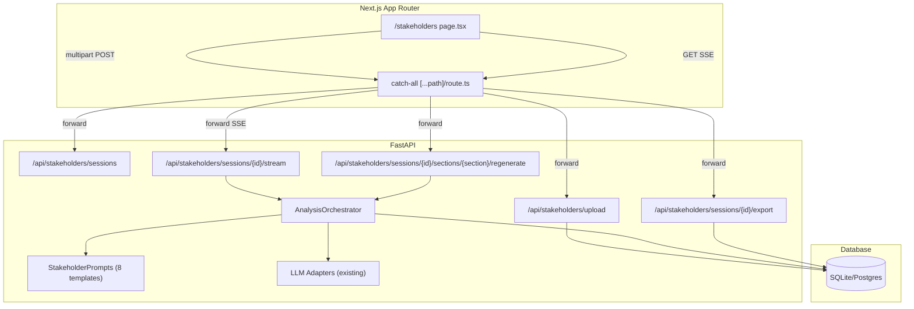
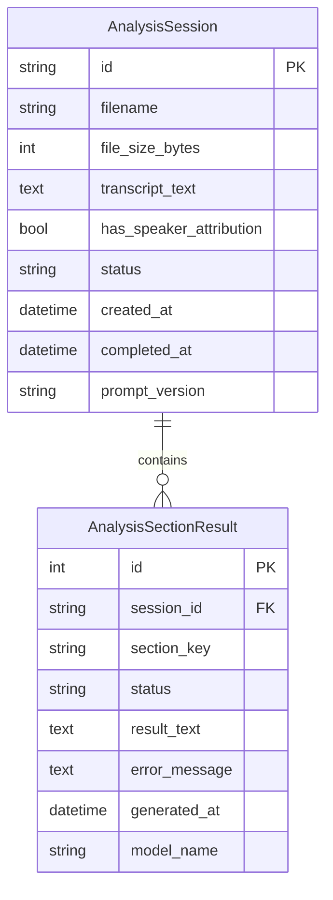

# Design Document: Stakeholder Analysis

## Overview

The Stakeholder Analysis feature adds a new `/stakeholders` page to the Northline delivery intelligence platform. It allows delivery managers to upload meeting transcripts and receive comprehensive AI-generated stakeholder intelligence across eight analysis sections. The feature reuses the existing Lodestar AI adapter infrastructure for LLM streaming and follows the established SSE pattern for real-time output delivery.

**Key Design Decisions:**
- Reuse the existing `_BaseAdapter` / `AzureOpenAIAdapter` / `OpenAIAdapter` / `ClaudeAdapter` infrastructure for all LLM calls
- Use `EventSourceResponse` from `sse-starlette` for streaming (same pattern as Lodestar)
- Run independent analysis sections in parallel via `asyncio.TaskGroup`
- Persist results using new SQLAlchemy models alongside existing tables
- Frontend uses the same inline-styles-with-CSS-tokens pattern as the rest of the Northline dashboard

## Architecture



**Data Flow:**
1. User uploads `.txt` transcript → `POST /api/stakeholders/upload` → stores transcript, creates session, returns session ID
2. Frontend opens SSE connection → `GET /api/stakeholders/sessions/{id}/stream` → orchestrator runs 8 prompts in parallel, streams chunks per section
3. Each section's output is persisted on completion → `AnalysisSectionResult` rows
4. User can regenerate individual sections → `POST /api/stakeholders/sessions/{id}/sections/{section}/regenerate`
5. User can export → `GET /api/stakeholders/sessions/{id}/export?format=markdown`

## Components and Interfaces

### Backend Components

#### 1. `app/stakeholders/__init__.py`
Package init exposing the router.

#### 2. `app/stakeholders/router.py`
FastAPI `APIRouter` with prefix `/api/stakeholders`. Endpoints:

```python
# Upload transcript and create session
POST /api/stakeholders/upload
  Request: multipart/form-data (file: UploadFile)
  Response: { "session_id": str, "filename": str, "warning": str | None }

# List past sessions
GET /api/stakeholders/sessions
  Response: [{ "id": str, "filename": str, "created_at": str, "status": str }]

# Get session detail with all section results
GET /api/stakeholders/sessions/{session_id}
  Response: { "id": str, "filename": str, "status": str, "sections": [...] }

# Stream analysis (SSE)
GET /api/stakeholders/sessions/{session_id}/stream
  Response: text/event-stream
  Events: { type: "section_start", section: str }
           { type: "chunk", section: str, text: str }
           { type: "section_done", section: str }
           { type: "section_error", section: str, error: str }
           { type: "all_done" }

# Regenerate a single section (SSE)
POST /api/stakeholders/sessions/{session_id}/sections/{section}/regenerate
  Response: text/event-stream (same event types, single section)

# Export session
GET /api/stakeholders/sessions/{session_id}/export?format=markdown
  Response: text/markdown file download

# Delete session
DELETE /api/stakeholders/sessions/{session_id}
  Response: { "status": "ok" }
```

#### 3. `app/stakeholders/orchestrator.py`
The `AnalysisOrchestrator` class coordinates section execution:

```python
class AnalysisOrchestrator:
    """Runs analysis sections against a transcript using LLM adapters."""

    SECTIONS: list[str] = [
        "speaker_statistics",
        "meeting_minutes",
        "raid_log",
        "delivery_signals",
        "team_health",
        "gap_analysis",
        "empathy_map",
        "stakeholder_register",
    ]

    def __init__(self, adapter: _BaseAdapter, session_id: str, transcript: str):
        ...

    async def run_all(self) -> AsyncGenerator[dict, None]:
        """Run all 8 sections in parallel, yielding SSE events."""
        ...

    async def run_section(self, section: str) -> AsyncGenerator[dict, None]:
        """Run a single section, yielding SSE events."""
        ...
```

Parallelism strategy: All 8 sections are independent (no data dependencies between them), so they run concurrently via `asyncio.TaskGroup`. Each section's chunks are multiplexed onto a single SSE stream with section identifiers.

#### 4. `app/stakeholders/prompts.py`
Contains the 8 prompt templates:

```python
STAKEHOLDER_PROMPT_VERSION = "v1.0"

SECTION_PROMPTS: dict[str, str] = {
    "speaker_statistics": "...",
    "meeting_minutes": "...",
    "raid_log": "...",
    "delivery_signals": "...",
    "team_health": "...",
    "gap_analysis": "...",
    "empathy_map": "...",
    "stakeholder_register": "...",
}

def build_section_prompt(section: str, transcript: str) -> str:
    """Inject transcript into the section's prompt template."""
    ...
```

#### 5. `app/stakeholders/export.py`
Export service:

```python
class ExportService:
    """Converts analysis results to exportable formats."""

    def to_markdown(self, session: AnalysisSession, sections: list[AnalysisSectionResult]) -> str:
        """Generate full Markdown document with metadata header and all sections."""
        ...
```

### Frontend Components

#### Component Hierarchy

```
/stakeholders/page.tsx (StakeholderAnalysisPage)
├── SessionHistory (sidebar/list of past sessions)
├── TranscriptUploader (file input + confirm button)
├── AnalysisProgress (section status indicators)
├── SectionPanel (×8, one per analysis section)
│   ├── SectionHeader (title + regenerate button)
│   └── SectionContent (streaming text or persisted result)
├── EmpathyMapGrid (6-quadrant visual layout)
├── InfluenceMapQuadrant (2×2 Power/Interest visualization)
└── ExportBar (export Markdown + copy-to-clipboard buttons)
```

#### Key Component Interfaces

```typescript
// Section status tracking
type SectionStatus = "pending" | "streaming" | "complete" | "error";

interface SectionState {
  status: SectionStatus;
  text: string;
  error?: string;
}

interface AnalysisPageState {
  sessionId: string | null;
  filename: string | null;
  sections: Record<string, SectionState>;
  uploadWarning: string | null;
}

// SSE event types from backend
type SSEEvent =
  | { type: "section_start"; section: string }
  | { type: "chunk"; section: string; text: string }
  | { type: "section_done"; section: string }
  | { type: "section_error"; section: string; error: string }
  | { type: "all_done" };
```

### Prompt Templates

The 8 analysis prompts share a common structure:

```
System: You are a delivery intelligence analyst specializing in {domain}.
Context: The following is a meeting transcript from a delivery team meeting.
Task: {section-specific instructions}
Format: {output format specification}
Transcript:
---
{transcript_content}
---
```

| # | Section | Key Instructions | Max Tokens |
|---|---------|-----------------|------------|
| 1 | Speaker Statistics | Parse speaker names, count utterances/words, compute share of voice %, identify top interaction pairs, flag <5% speakers, compute concentration ratio | 600 |
| 2 | Meeting Minutes | Extract decisions (Decision/Owner/Context table), commitments (Commitment/Owner/Due Date table), open questions (list with speaker) | 800 |
| 3 | RAID Log | Categorize into Risks/Assumptions/Issues/Dependencies tables, assign severity/probability/impact ratings (High/Medium/Low) | 800 |
| 4 | Delivery Signals | Classify action items into P1/P2/P3 tiers with description, owner, rationale | 600 |
| 5 | Team Health | Assess voice concentration, facilitation effectiveness, blocker surfacing, agile maturity signals, overall score 1-10 | 600 |
| 6 | Gap Analysis | Identify absent teams/roles, undiscussed topics, suggested questions | 500 |
| 7 | Empathy Map | Select 1-2 key stakeholders, generate Thinks/Feels/Says/Does/Pains/Gains for each | 700 |
| 8 | Stakeholder Register | Classify stakeholders into 4 tiers, produce Power/Interest coordinates for influence map | 600 |

Prompt version is tracked in `STAKEHOLDER_PROMPT_VERSION` for future staleness detection (same pattern as Lodestar's `CURRENT_PROMPT_VERSION`).

## Data Models

### New Tables

```python
class AnalysisSession(Base):
    """A single stakeholder analysis run against one transcript."""
    __tablename__ = "analysis_session"

    id: Mapped[str] = mapped_column(String(36), primary_key=True)  # UUID
    filename: Mapped[str] = mapped_column(String(255), nullable=False)
    file_size_bytes: Mapped[int] = mapped_column(Integer, nullable=False)
    transcript_text: Mapped[str] = mapped_column(Text, nullable=False)
    has_speaker_attribution: Mapped[bool] = mapped_column(Boolean, default=True)
    status: Mapped[str] = mapped_column(String(20), nullable=False)  # "pending" | "running" | "complete" | "failed"
    created_at: Mapped[datetime] = mapped_column(DateTime, default=_utcnow)
    completed_at: Mapped[Optional[datetime]] = mapped_column(DateTime, nullable=True)
    prompt_version: Mapped[str] = mapped_column(String(20), nullable=False)

    sections: Mapped[list["AnalysisSectionResult"]] = relationship(
        back_populates="session", cascade="all, delete-orphan"
    )


class AnalysisSectionResult(Base):
    """Result of one analysis section within a session."""
    __tablename__ = "analysis_section_result"
    __table_args__ = (UniqueConstraint("session_id", "section_key"),)

    id: Mapped[int] = mapped_column(primary_key=True)
    session_id: Mapped[str] = mapped_column(ForeignKey("analysis_session.id"), nullable=False)
    section_key: Mapped[str] = mapped_column(String(50), nullable=False)  # e.g. "speaker_statistics"
    status: Mapped[str] = mapped_column(String(20), nullable=False)  # "pending" | "running" | "complete" | "error"
    result_text: Mapped[Optional[str]] = mapped_column(Text, nullable=True)
    error_message: Mapped[Optional[str]] = mapped_column(Text, nullable=True)
    generated_at: Mapped[Optional[datetime]] = mapped_column(DateTime, nullable=True)
    model_name: Mapped[str] = mapped_column(String(100), nullable=True)

    session: Mapped["AnalysisSession"] = relationship(back_populates="sections")
```

### Entity Relationship



### Migration

A new migration file `app/migrations/add_stakeholder_analysis.py` will create both tables using the same pattern as existing migrations (e.g., `add_feature_narrative.py`).

## SSE Streaming Design

The streaming design reuses the established Lodestar pattern with one extension: **multiplexed section events** on a single SSE connection.

### Event Protocol

```
# Session stream (GET /api/stakeholders/sessions/{id}/stream)
data: {"type": "section_start", "section": "speaker_statistics"}
data: {"type": "chunk", "section": "speaker_statistics", "text": "## Speaker Statistics\n"}
data: {"type": "chunk", "section": "meeting_minutes", "text": "## Meeting Minutes\n"}
...
data: {"type": "section_done", "section": "speaker_statistics"}
data: {"type": "section_error", "section": "raid_log", "error": "Timeout after 30s"}
...
data: {"type": "all_done"}
```

### Multiplexing Strategy

Since all 8 sections run in parallel, chunks from different sections interleave on the same SSE stream. Each event includes a `section` field so the frontend can route chunks to the correct panel.

```python
async def _multiplexed_generator(
    orchestrator: AnalysisOrchestrator,
    session_id: str,
    background_tasks: BackgroundTasks,
) -> AsyncGenerator[dict, None]:
    """
    Multiplexes chunks from all parallel sections onto one SSE stream.
    Uses an asyncio.Queue as a fan-in point for all section tasks.
    """
    queue: asyncio.Queue[dict] = asyncio.Queue()
    sections_remaining = len(AnalysisOrchestrator.SECTIONS)

    async def section_worker(section: str):
        nonlocal sections_remaining
        try:
            yield_event = lambda e: queue.put_nowait(e)
            await queue.put({"data": json.dumps({"type": "section_start", "section": section})})
            adapter = _get_adapter()
            prompt = build_section_prompt(section, orchestrator.transcript)
            async for chunk in adapter.stream(prompt):
                await queue.put({"data": json.dumps({"type": "chunk", "section": section, "text": chunk})})
            await queue.put({"data": json.dumps({"type": "section_done", "section": section})})
        except Exception as exc:
            await queue.put({"data": json.dumps({"type": "section_error", "section": section, "error": str(exc)})})
        finally:
            sections_remaining -= 1
            if sections_remaining == 0:
                await queue.put(None)  # sentinel

    async with asyncio.TaskGroup() as tg:
        for section in AnalysisOrchestrator.SECTIONS:
            tg.create_task(section_worker(section))

    # Drain the queue
    while True:
        event = await queue.get()
        if event is None:
            break
        yield event

    yield {"data": json.dumps({"type": "all_done"})}
```

### Frontend SSE Consumption

```typescript
function useAnalysisStream(sessionId: string) {
  // Open EventSource to /api/stakeholders/sessions/{sessionId}/stream
  // Parse each event, route to correct section state
  // On "section_done" → mark section complete
  // On "all_done" → close connection
  // On error → show retry per-section
}
```

The catch-all proxy at `dashboard/app/api/[...path]/route.ts` already handles SSE forwarding (detects `text/event-stream` content-type and streams the `response.body` as a `ReadableStream`). No changes needed to the proxy.

### Timeout Configuration

- Per-section timeout: 30 seconds (higher than Lodestar's 12s due to larger prompts)
- Configurable via `STAKEHOLDER_STREAM_TIMEOUT_SECONDS` env var

## Export Service Design

The `ExportService` generates Markdown documents from persisted analysis results.

### Markdown Output Format

```markdown
# Stakeholder Analysis Report

**Transcript:** {filename}
**Date:** {created_at formatted}
**Sections:** {count complete}/{count total}

---

## 1. Speaker Statistics

{speaker_statistics result_text}

## 2. Meeting Minutes

{meeting_minutes result_text}

...

## 8. Stakeholder Register

{stakeholder_register result_text}
```

### Clipboard Copy

For single-section clipboard copy, the frontend calls `navigator.clipboard.writeText(sectionContent)` directly — no backend involvement.

## Correctness Properties

*A property is a characteristic or behavior that should hold true across all valid executions of a system — essentially, a formal statement about what the system should do. Properties serve as the bridge between human-readable specifications and machine-verifiable correctness guarantees.*

### Property 1: Upload creates session with stored content

*For any* valid `.txt` file content (non-empty, ≤ 5MB), uploading it to the Analysis Engine SHALL return a unique session ID and the transcript content SHALL be retrievable from the database using that ID, identical to what was uploaded.

**Validates: Requirements 1.3**

### Property 2: Non-speaker text accepted with warning

*For any* text content that does not match the speaker attribution pattern (e.g., `"Speaker: utterance"`), the upload SHALL succeed (status 200) and the response SHALL include a warning flag indicating results may be limited.

**Validates: Requirements 1.6**

### Property 3: Fault-tolerant orchestration

*For any* subset of analysis sections that raise exceptions during execution, the remaining sections SHALL complete successfully, each failed section SHALL have status "error", and the session SHALL reach a terminal status of "complete" (not stuck in "running").

**Validates: Requirements 2.4, 2.5**

### Property 4: Speaker statistics summation invariant

*For any* speaker statistics result containing N speakers with utterance counts and word counts, the sum of all individual utterance counts SHALL equal the total utterances, the sum of all word counts SHALL equal the total words, and the sum of all share-of-voice percentages SHALL equal 100% (±0.1% rounding tolerance).

**Validates: Requirements 4.2**

### Property 5: Silent participant threshold

*For any* speaker statistics result, every speaker with share of voice below 5% SHALL appear in the silent participants list, and no speaker with share of voice ≥ 5% SHALL appear in that list.

**Validates: Requirements 4.4**

### Property 6: Concentration ratio bounds

*For any* speaker statistics result with N > 0 speakers, the concentration ratio SHALL be a number in the range [0.0, 1.0], and for a perfectly even distribution (all speakers have equal share), the ratio SHALL equal 1/N.

**Validates: Requirements 4.5**

### Property 7: RAID rating enum constraints

*For any* RAID log section result, every Risk and Issue SHALL have a severity value in {High, Medium, Low}, every Risk SHALL have a probability value in {High, Medium, Low}, and every Dependency SHALL have an impact value in {High, Medium, Low}.

**Validates: Requirements 6.2, 6.3, 6.4**

### Property 8: Priority tier and action item completeness

*For any* delivery signals section result, every action item SHALL have a priority in {P1, P2, P3}, a non-empty description, and a non-empty classification rationale.

**Validates: Requirements 7.1, 7.2**

### Property 9: Team health score bounds

*For any* team health section result, the overall health score SHALL be an integer in the range [1, 10].

**Validates: Requirements 8.5**

### Property 10: Empathy map quadrant completeness

*For any* empathy map section result containing 1-2 stakeholders, each stakeholder's map SHALL contain exactly 6 non-empty quadrants: Thinks, Feels, Says, Does, Pains, and Gains.

**Validates: Requirements 10.2**

### Property 11: Stakeholder register structure validity

*For any* stakeholder register section result, every stakeholder SHALL be classified into one of exactly 4 tiers, and every stakeholder SHALL have Power and Interest values each in the range [0, 1] (normalized coordinates for the influence map).

**Validates: Requirements 11.1, 11.2**

### Property 12: Session persistence round-trip

*For any* completed analysis session with N section results, retrieving the session by ID SHALL return all N sections with their result text identical to what was persisted, and SHALL NOT invoke any LLM adapter calls.

**Validates: Requirements 12.1, 12.3**

### Property 13: Section regeneration isolation

*For any* valid section key within a completed session, triggering regeneration SHALL invoke exactly one LLM prompt (for that section only), and after completion the persisted result for that section SHALL differ from the pre-regeneration value while all other sections remain unchanged.

**Validates: Requirements 13.1, 13.2**

### Property 14: Export completeness

*For any* completed analysis session, the exported Markdown document SHALL contain the transcript filename, the analysis date, a header for each of the 8 sections, and the full result text of every completed section.

**Validates: Requirements 14.1, 14.3**

## Error Handling

### Backend Error Taxonomy

| Error | HTTP Status | Behavior |
|-------|-------------|----------|
| File too large (>5MB) | 413 | Reject with message: "File exceeds 5MB limit" |
| Unsupported format | 415 | Reject with message: "Only .txt files are supported" |
| Session not found | 404 | Standard 404 response |
| LLM adapter timeout (per section) | — | Mark section as "error", continue others |
| LLM adapter auth failure | — | Mark section as "error" with auth error detail |
| LLM rate limit | — | Retry with exponential backoff (3 attempts), then mark error |
| Database write failure | 500 | Log and return internal server error |
| SSE client disconnect | — | Cancel in-flight adapter, do NOT persist incomplete results |

### Frontend Error Handling

- **Upload errors**: Display inline error message below the file input
- **SSE connection drop**: Show per-section "Retry" button; clicking triggers `POST .../regenerate`
- **Section-level errors**: Display error message in the section panel with a "Regenerate" button
- **Backend unreachable**: Show banner-level error with retry action (same pattern as existing features page)

### Graceful Degradation

- If the LLM adapter is unavailable, the upload still succeeds (transcript is stored), but streaming returns errors for all sections
- Partial results are preserved — if 6/8 sections complete before a disconnect, those 6 are persisted

## Testing Strategy

### Property-Based Tests (Hypothesis)

The project uses Python with pytest. Property-based tests will use the `hypothesis` library.

**Configuration:**
- Minimum 100 examples per property
- Each test tagged with: `# Feature: stakeholder-analysis, Property {N}: {title}`
- Test file: `tests/test_stakeholder_properties.py`

**Properties to implement:**
1. Upload session creation round-trip
2. Non-speaker text warning detection
3. Fault-tolerant orchestration (mock adapter with random failures)
4. Speaker statistics summation invariant
5. Silent participant threshold correctness
6. Concentration ratio bounds
7. RAID rating enum constraints (parse and validate output)
8. Priority tier and action item field completeness
9. Team health score bounds
10. Empathy map quadrant completeness
11. Stakeholder register structure validity
12. Session persistence round-trip
13. Section regeneration isolation
14. Export completeness

### Unit Tests (pytest)

- Upload validation (file size, format checks)
- Prompt template rendering (verify transcript injection)
- Export Markdown formatting
- SSE event serialization
- Session status transitions (state machine)
- Speaker attribution detection regex

### Integration Tests

- Full upload → stream → persist flow with mock LLM adapter
- SSE event sequence correctness
- Database CRUD operations for sessions and sections
- API endpoint response formats
- Regeneration flow end-to-end

### Frontend Tests (Jest / React Testing Library)

- `TranscriptUploader` file selection and validation
- `SectionPanel` rendering in each status state
- `EmpathyMapGrid` quadrant layout
- `InfluenceMapQuadrant` positioning
- `ExportBar` clipboard and download actions
- SSE event routing to correct section state
